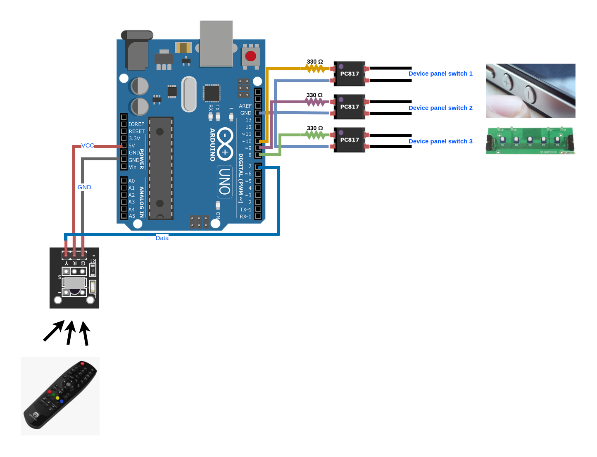

# IR Remote Control Unifier

It can happen that you have an old device for which you have either no remote control, or you need a way to control the device using the remote controller of another device. I own a relatively old amplifier with its own remote controller. When I connect it to my TV using an optical audio cable, I have no control over the amplifier with the remote controller of the TV. On the other hand I want to be able to control both the TV and the amplifier using the same remote controller, the TV's remote. That's why I built the IR Remote Control Unifier using an Arduino Uno. In order to have such a system working, you need to connect the board as explained to the push buttons of your device which you want to enable working with the remote of another device. 

Once connected to the PC using a USB cable and after programming the Arduino, you can point the remote controller you want to share and push the buttons you need to share one after another to see what HEX codes are sent by pushing those particular buttons. That you can see using the serial monitor of the Arduino IDE or any other tool to monitor the serial port. Then you need to change the values in the cases of `swtich` to trigger the outputs only when the desired HEX code is received.

Note that you can add more PC817 to control more buttons.